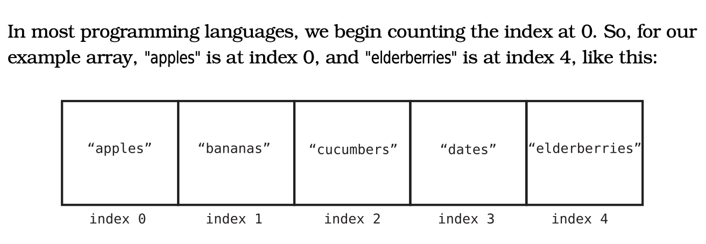

# Data-structure-and-algorithm-in-python

## Data-structure

before we start fully with data structure and algorithm
we first of have to understand some concepts right ??

1. what is Data ?
2. what is Data-structure ?
3. why Data-Structure ?

if we are able to answer these three question I think and believe
good to go with Data-structure.

* so what is DATA ?
    as we all know in basic computer, data is what ? 
    an unprocessed raw facts right ?? the data can be
    any type such as images, documents, numbers, strings
    that can be processed by the computer.

* then now what is Data-Structure ?
    Data structure is a way of storing data in the 
    computer, so it can be used efficiently.
    its basically the art of arranging the data in
    a way that allows the computer to perform operations
    on the data efficiently.

## why do we need DATA-STRUCTURE ?

in the early days of programming, programmeers only have one 
wish or mechanism of anaylysing code, which is ?? 😂 guess you
must have known the answer 😂😂, tell me nahhhh 🙏🙏, you don't 
want to talk abi ?? ok oo let me answer which is *("is the code working?")
once their code is working that is like the deal-breaker for them.
it made sense that way, not until developers started noticing that 
two or different persons can actually solve or implement a task in different
ways and still get the same result, and now that their codes that were working
initially, they started to observing that, is like one's code runs faster than 
other right ??,they now start finding a way to calculate it how much time a program
takes to complete and space the program also takes in our computer during runtime, and 
that was when they came up with * TIME COMPLEXITY AND SPACE COMPLEXITY. these two help
us to know how much time and space our program takes during runtime, click link to see how
two different codes solves a problem in with two different approach, would want to anaylyse
the code that runs faster than another yourself[check time efficiency](main.py)
that way we can write efficient programs using the right DATA-STRUCTURE.

## we have various types of DATA-STRUCTURE:
1. Arrays Data-structure

2. linked->list Data-structure

3. stack Data-structure

4. queue Data-structure

5. Tree Data-structure

6. Graph Data-structure

* let's look at Array Datastructure
# ARRAY

lets talk bout arrays, wat are arrays ?? array are a type of Datastructure that stores elements in a contigous memeory location.

characteristics of arrays 

1. arrays store codes in contigous block
2. the elements of array are of the same type
    that is it cannot store elements of different types
3. arrays are indexed from 0
4. deleting and an element in an array takes constant time
    O(1).
5. searching an element in an array takes big O of n O(n).
6. formular to find the last index is size - 1
7. arrays are mutable (we can change the value of an array)

# Linked->lists

what is linked->list Datastructure ??

linked -> list is a type of Datastructure that stores elements in memory in form of  nodes where a node has the element and a pointer to the next node, the reason for the pointer is a way to have access to the next node that has the next element in the memory,unlike arrays Linked->lists are not stored in Contigous Memory Locations.

## Characteristics of LINKED->LISTS

1. they are not stored in contigous Memory location.

